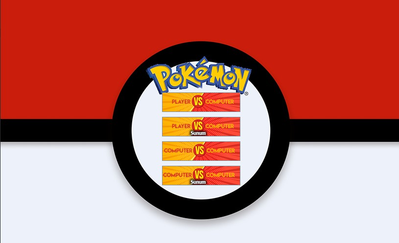
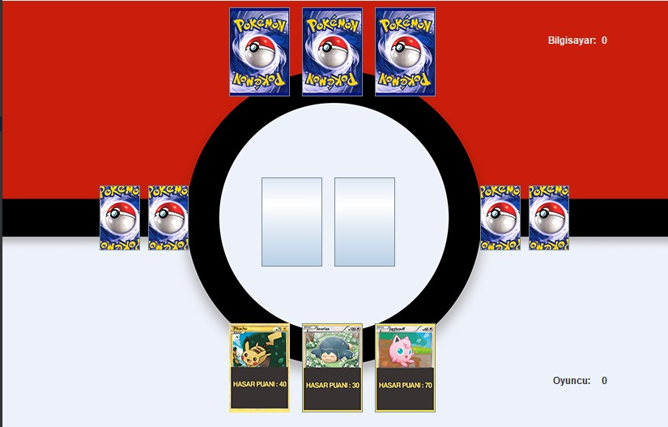
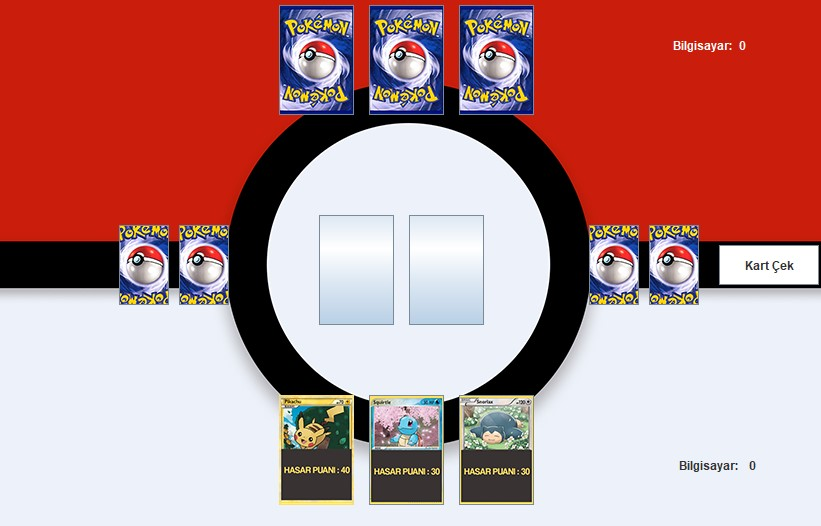

=== 2D Pokemon Card Game

Proje ödevi için geliştirilmiştir. Geliştirme aşamasında IDE olarak NetBeans, programlama dili olarak Java, arayüz içinse Swing GUI kullanılmıştır.

*Amaç:* Nesneye yönelik programlama yapısının anlaşılması ve pratik uygulama ile tecrübe edilmesidir.

Oyunda kullanıcıya karşı bilgisayar ya da bilgisayara karşı bilgisayar seçenekleri bulunmaktadır. Sunum modlu butonlarda ise karşı oyuncunun elindeki kartlar görünmektedir.

Oyun toplamda 10 adet pokemon kartından oluşmaktadır ve her kullanıcıya rastgele 3'er kart dağıtılacaktır. Her tur sonunda kazanan tarafa 5 puan eklenir.

==== Oyun içi görseller

*Menü*

*Player vs Computer*

Eldeki kartlara tıklandığı takdirde bilgisayar oyuncusu da otomatik hamle yapmaktadır.

*Computer vs Computer*

Kart çek butonuna basıldığı takdirde iki bilgisayarda otomatik hamle yapar.

